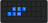
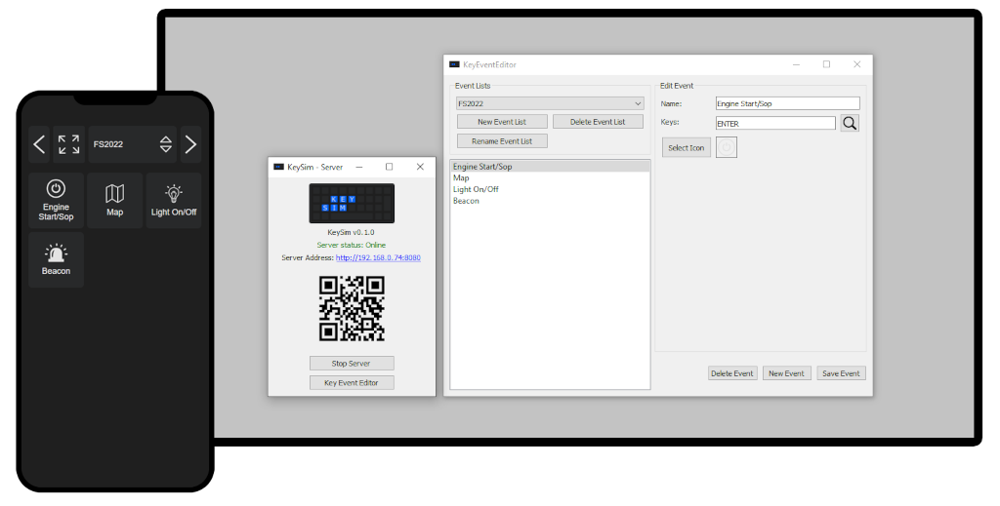

# KeySim

  

KeySim extend the control possibilities in your favorite games. Use your smartphone, tablet or any device with a web browser to control your game. With own defined lists of buttons, KeySim can synthesize single or multiple keystrokes of the keyboard. With the included editor it's easy to create own lists of buttons with customizable text and icons. So you don't have to remember all the complicated key combination of e.g. simulation games. Originally KeySim was developed for simulation games e.g. Farming Simulator 2022 (FS22) or Euro Truck Simulator 2 (ETS2), but it can used in any other games or applications. To synthesize the keystrokes KeySim use the Windows API [`winuser.h`](https://learn.microsoft.com/en-us/windows/win32/api/winuser/) which is also compatible with DirectX games.

  

# First Start
## Run with pre build standalone executable
1. Download the [latest released](releases/latest) version, extract the .ZIP file and run the `keysim_gui.exe` or build it from source, see [build step](#build-executable).
2. Press the button `Start Server`. Now a local server should running on your PC. For the first start KeySim will be blocked by the Windows Firewall. Allow access in the popup window.
3. Type the shown server address in your web browser on your favorite device or scan the QR code. Make sure the PC and the device are in the same network!
4. Now select a list e.g. `Example` with the keyboard buttons on the website and have fun.

## Run from source code
1. Clone latest version of the repository: `git clone https://github.com/mthier/keysim.git`
2. Install all Python requirements locally or in virtual environment (recommended): `pip install -r requirements.txt`
3. Start main script: `python key_sim.py`
4. Click the button `Start Server`. Now a local server should running on your PC. For the first start KeySim will be blocked by the Windows Firewall. Allow access in the popup window.
5. Type the shown server address in your web browser on your favorite device or scan the QR code. Make sure the PC and the device are in the same network!
6. Now select a list e.g. `Example` with the keyboard buttons on the website and have fun.

## Create own key event lists
To create your own lists with buttons use the key event editor. To open the editor click the button `Key Event Editor` in the main GUI. There you can create, delete and modify key events.
Hint: Use the key listener to recognize pressed keystrokes. Click on the lens icon to open the key listener!

## Requirements
* Windows 7/8/10/11
* Python > 3.8
    * blinker==1.6.2
    * click==8.1.3
    * Flask==2.3.1
    * itsdangerous==2.1.2
    * Jinja2==3.1.2
    * MarkupSafe==2.1.2
    * Pillow==9.5.0
    * pypng==0.20220715.0
    * PyQt5==5.15.9
    * PyQt5-Qt5==5.15.2
    * PyQt5-sip==12.12.1
    * qrcode==7.4.2
    * typing_extensions==4.5.0
    * Werkzeug==2.3.2
    * pyinstaller==6.4.0

## Build executable
1. Install all Python requirements locally or in virtual environment (recommended): `pip install -r requirements.txt`
2. Create executable with PyInstaller: `pyinstaller key_sim.spec`
    * In some case it's necessary to deactivate the Windows Defender, because the Windows Defender prevent the PyInstaller to build the executable!
3. Build results now located in the dist folder

## Icons
To add more icons to KeySim, copy your icons to `./static/images/event_icons`. To get more free icons you can checkout the website [uxwinf.com](https://uxwing.com).
